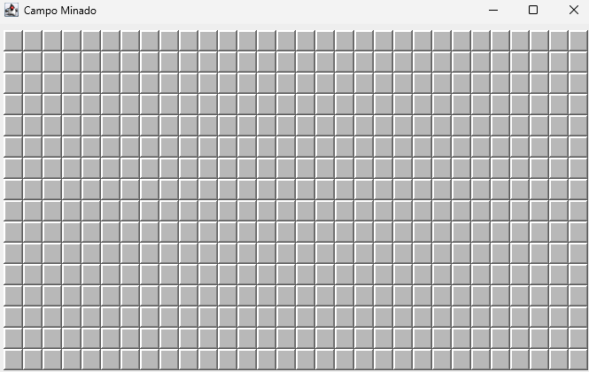
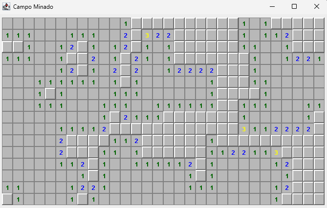
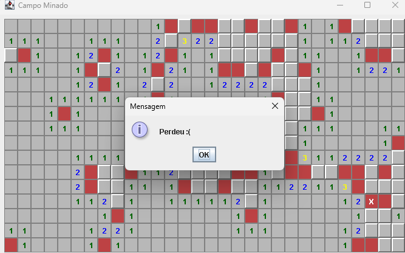

# 💣 Campo Minado em Java Swing

Bem-vindo ao projeto do jogo Campo Minado, este foi meu primeiro projeto feito em 2023 de uma aplicação desktop clássica desenvolvida em Java, utilizando a biblioteca **Java Swing** para a interface gráfica. O jogo oferece uma experiência de lógica e raciocínio em um ambiente gráfico simples e funcional.

### 🎮 Visão Geral

Este projeto foi criado como um exercício prático de desenvolvimento de jogos em Java, explorando a criação de interfaces com Swing, a lógica de um tabuleiro de jogo e o gerenciamento de eventos do usuário (cliques, por exemplo).

O jogo oferece:

* **Tabuleiro interativo** para a lógica do jogo.
* **Contagem de minas** vizinhas.
* **Indicação visual** de vitória ou derrota.
* **Lógica de auto-revelação** de células vazias.

### 🖼️ Telas do Jogo

#### Tela Inicial

Mostra o tabuleiro do Campo Minado, pronto para o primeiro movimento.

#### Jogando

Ilustra o tabuleiro com algumas células reveladas, mostrando os números de minas adjacentes.

#### Fim de Jogo

Exibe a mensagem de derrota após o jogador clicar em uma mina.

### ✨ Funcionalidades

* **Tabuleiro dinâmico:** Criação de um tabuleiro com minas distribuídas aleatoriamente.
* **Feedback visual:** Diferentes estados das células (não revelada, revelada, com mina, com bandeira).
* **Mensagens de status:** Alertas para vitória ou derrota.
* **Interface simples:** Desenvolvida inteiramente com Java Swing.

### 🛠️ Tecnologias Utilizadas

* **Java**
* **Java Swing** (para a interface gráfica)

# 4. Execute a classe principal
java Main
